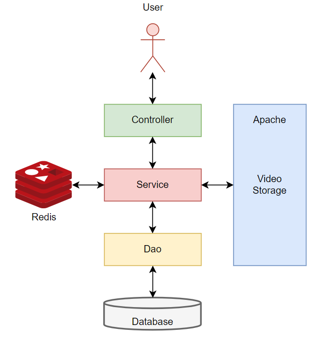

# 极简版抖音后端服务

## 技术选型

该项目是字节跳动第五届青训营的大作业项目。

| 需求       | 技术选型                    | 原因                                               |
| ---------- | --------------------------- | -------------------------------------------------- |
| 数据持久化 | MySQL                       | 免费，习惯                                         |
| 缓存       | Redis                       | 学习使用高性能内存存储                             |
| WEB框架    | Gin                         | 上传视频无大小限制                                 |
| ORM框架    | GORM                        | 学习使用GORM框架                                   |
| 服务器     | 一台腾讯云轻量级服务器2核2G | 在线提供服务                                       |
| 压缩存储   | ffmpeg                      | 可以很大程度上对视频进行压缩，并且画质损失不会很大 |

## 架构设计



整体采用单体架构，在一台服务器上运行所有服务，服务在Controller层被转发给相应的Service，Service调用Dao接口进行数据的持久化，除此之外Publish Service还会将视频存储到Apache文件服务器，进行视频存储，在Message Service中使用Redis存储部分控制数据，Dao层使用GORM对MySQL数据库进行操作。

## 项目代码介绍

```plaintext
.
├── controller
│   ├── comment.go
│   ├── favorite.go
│   ├── feed.go
│   ├── message.go
│   ├── publish.go
│   ├── relation.go
│   └── user.go
├── dao
│   ├── comment.go
│   ├── db_init.go
│   ├── message.go
│   ├── README.md
│   ├── user_follow.go
│   ├── user.go
│   ├── video_favorite.go
│   └── video.go
├── douyin
├── go.mod
├── go.sum
├── main.go
├── public
│   └── bear.mp4
├── README.md
├── router.go
├── service
│   ├── comment.go
│   ├── common.go
│   ├── favorite.go
│   ├── feed.go
│   ├── message.go
│   ├── publish.go
│   ├── relation.go
│   └── user.go
└── test
    ├── dao
    │   ├── comment_test.go
    │   ├── message_test.go
    │   ├── user_follow_test.go
    │   ├── user_test.go
    │   ├── video_favorite_test.go
    │   └── video_test.go
    ├── README.md
    └── service
        ├── comment_test.go
        ├── favorite_test.go
        ├── feed_test.go
        ├── message_test.go
        ├── publish_test.go
        ├── relation_test.go
        └── user_test.go
```

代码整体分为三层

* 最下层是数据访问层，主要涉及一些数据库的相关操作，以及实体对象的构建。
* 中间层是服务层，主要调用下层接口，实现功能，并向外层提供服务。
* 最上层是控制层，主要涉及请求的解析以及响应的构造。
